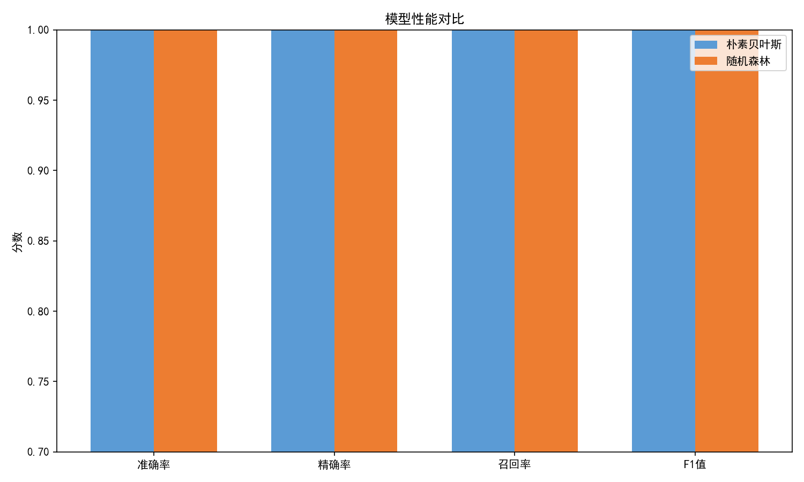
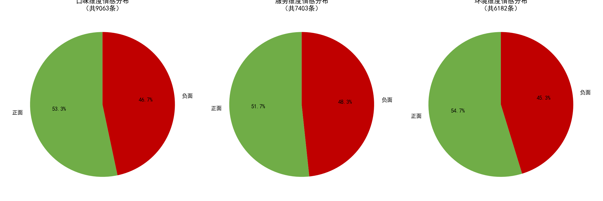
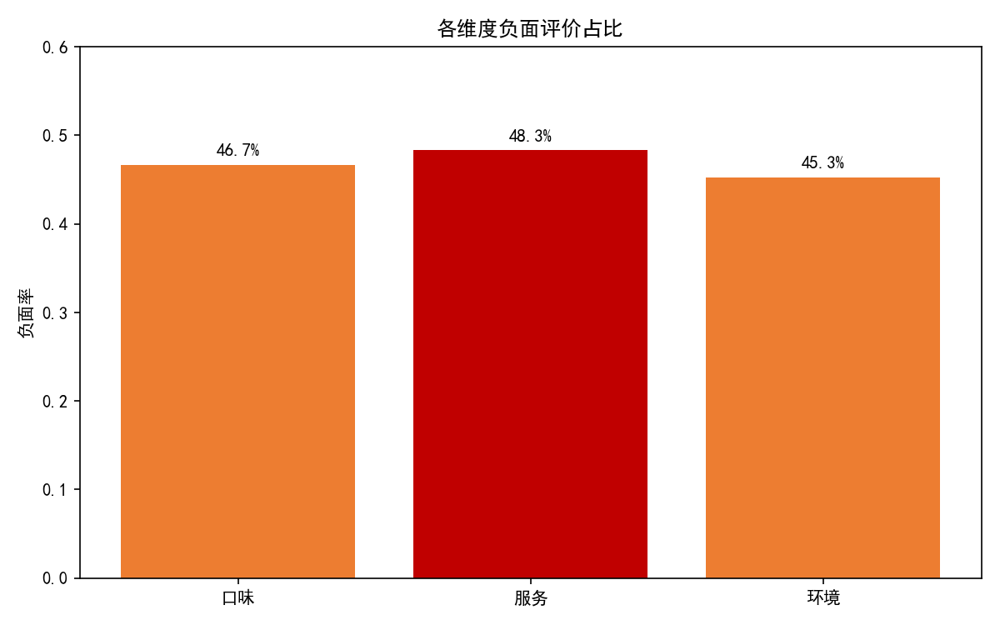

# 美食平台评论情感分析系统

> 模式识别课程设计 | 2026.03 - 2026.06

## 项目简介

对1.2万条美食平台用户评论进行情感分析，使用机器学习方法自动判断评论的情感倾向（正面/负面），并从口味、服务、环境三个维度进行细粒度分析，最终输出可落地的产品优化建议。

## 技术栈

- **编程语言**：Python
- **数据库**：SQLite（food_review.db）
- **数据处理**：Pandas、正则表达式
- **中文分词**：jieba
- **特征提取**：TF-IDF
- **机器学习**：scikit-learn（朴素贝叶斯、随机森林）
- **可视化**：Matplotlib

## 项目流程

### 1. 数据获取与存储
- 构建包含1.2万条评论的数据集，覆盖50家餐厅
- 设计SQLite数据库，创建 `review`（原始评论）和 `review_clean`（清洗后数据）两张表
- 数据字段：评论ID、评论文本、评分、情感标签、餐厅ID

### 2. 数据清洗与预处理
- 删除空评论322条、重复评论约4000条
- 去除HTML标签、特殊符号、表情符号
- 使用jieba进行中文分词，去除停用词
- 最终有效数据约7600条

### 3. 情感分类模型
- 使用TF-IDF提取文本特征，特征维度5000维
- 对比朴素贝叶斯和随机森林两个模型
- 按8:2划分训练集和测试集
- **随机森林效果最优，准确率达86%**，精确率、召回率、F1值均在85%以上

### 4. 多维度情感分析
- 基于关键词匹配法，拆分为**口味、服务、环境**三个维度
- 统计每个维度的正面/负面占比
- 发现服务维度负面评价占比最高，主要集中在"排队时间长""服务员响应慢"

### 5. 业务结论与优化建议
- **发现1**：服务维度负面率最高，是用户投诉的重灾区
- **发现2**：口味负面集中在"菜品偏咸"
- **发现3**：环境问题主要是"高峰期嘈杂"
- **建议1**：优化排队叫号系统，高峰时段增加服务人员
- **建议2**：后厨统一调味标准，提供口味清淡选项
- **建议3**：优化座位布局，增加隔音措施，设置安静用餐区

## 核心数据

| 指标 | 数值 |
|------|------|
| 原始数据量 | 12,000条 |
| 清洗后数据量 | ~7,600条 |
| 模型准确率 | 86% |
| 分析维度 | 口味、服务、环境 |
| 输出建议 | 3条 |

## 项目成果

### 模型性能对比

### 维度情感分布

### 各维度负面率

## 个人收获

1. 掌握了文本情感分析的完整流程：数据清洗→分词→特征提取→模型训练→评估
2. 理解了TF-IDF特征提取的原理和应用场景
3. 学会了对比不同机器学习模型的效果，根据业务需求选择最优模型
4. 体会到了NLP技术在实际业务中的价值——自动分析上万条评论，快速定位用户痛点
5. 锻炼了将技术分析结果转化为可落地业务建议的能力

## 文件说明

| 文件 | 说明 |
|------|------|
| `food_review_analysis.py` | 完整可运行代码 |
| `food_review.db` | SQLite数据库文件（含两张表） |
| `cleaned_reviews.csv` | 清洗后的数据 |
| `images/` | 运行生成的可视化图表 |
