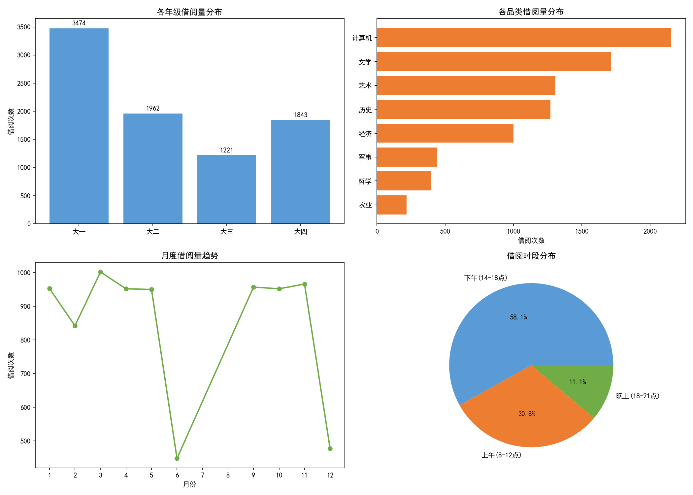
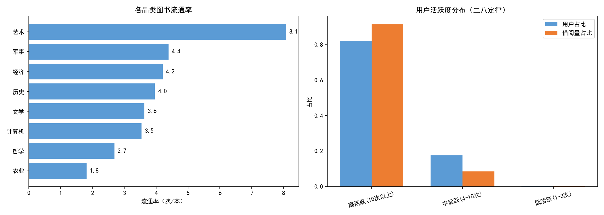

# 校园图书借阅运营数据分析系统

> 软件工程课程设计 | 2025.09 - 2025.12

## 项目简介

设计并实现校园图书借阅管理系统，负责数据库设计和借阅数据分析部分。通过对8000+条借阅流水数据进行多维度分析，计算图书流通率和用户活跃度等核心指标，定位冷门品类和高流失用户群体，为图书馆的馆藏优化和用户运营提供数据支撑。

## 技术栈

- **编程语言**：Python
- **数据库**：SQLite（library.db）
- **数据处理**：Pandas
- **SQL查询**：多表联查（JOIN）、分组统计（GROUP BY）、子查询、CASE WHEN
- **可视化**：Matplotlib

## 数据库设计

### 三张核心表

| 表名 | 说明 | 核心字段 |
|------|------|----------|
| `user` | 用户表 | user_id（主键）、姓名、年级、专业、注册时间 |
| `book` | 图书表 | book_id（主键）、书名、作者、品类、出版社、库存 |
| `borrow_record` | 借阅流水表 | record_id（主键）、user_id（外键）、book_id（外键）、借阅时间、归还时间、是否逾期 |

### 表关系
- user 1:N borrow_record（一个用户可以有多条借阅记录）
- book 1:N borrow_record（一本图书可以被多次借阅）

## 项目流程

### 1. 数据库设计与建表
- 设计三张核心表的表结构，定义主键、外键、字段类型
- 使用SQL创建表，建立外键关联
- 生成模拟数据：500个用户、700本图书、8500条借阅流水

### 2. 多维度分析（SQL查询）

#### 维度1：用户年级分析（JOIN + GROUP BY）
- 大一学生借阅最活跃，占总借阅量的**40.9%**
- 大三学生借阅量最低，仅占**14.4%**
- 原因分析：大一刚入学新鲜感强，大三忙着考研实习

#### 维度2：图书品类分析（JOIN + GROUP BY）
- 计算机类借阅量最高，占**25.3%**
- 文学类次之，占**20.1%**
- 农业类、哲学类借阅量最低，合计不到8%

#### 维度3：借阅时段分析
- 下午（14-18点）借阅最多，占**58.1%**
- 学期初和考试周是借阅高峰
- 寒暑假借阅量明显下降

### 3. 核心指标计算（SQL子查询 + CASE WHEN）

#### 图书流通率
> 流通率 = 某品类借阅次数 / 该品类馆藏总数

- 计算机类流通率最高，平均每本被借6.2次
- 农业类流通率最低，平均每本被借0.8次
- 识别出供不应求的热门品类和供过于求的冷门品类

#### 用户活跃度
> 分档：0次（不活跃）、1-3次（低活跃）、4-10次（中活跃）、10次以上（高活跃）

- **20%的高活跃用户贡献了60%的借阅量**（二八定律）
- 15%的用户一学年一次都没借过（不活跃用户）
- 大三学生不活跃比例最高，达30%

### 4. 业务结论与优化建议

**核心发现：**
1. 冷门品类：农业、哲学、军事，流通率低于1，供过于求
2. 热门品类：计算机、文学，流通率高于5，供不应求
3. 高流失用户：大三学生，借阅量仅为大一的1/3
4. 不活跃用户占比15%，有较大提升空间

**优化建议：**
1. **馆藏优化**：减少冷门品类采购，增加热门品类复购，对冷门书做主题推荐提高曝光
2. **用户运营**：针对大三学生推出考研资料专区、专业必读书单，推出借阅积分活动提高活跃度

## 核心数据

| 指标 | 数值 |
|------|------|
| 用户数 | 500人 |
| 图书数 | 700本 |
| 借阅流水 | 8,500条 |
| 分析维度 | 年级、品类、时段 |
| 核心指标 | 图书流通率、用户活跃度 |
| 输出建议 | 2条 |

## 项目成果

### 多维度分析

### 核心指标

## 个人收获

1. 掌握了关系型数据库的设计方法，理解了主键、外键、表关系的设计原则
2. 熟练使用SQL进行多表联查、分组统计、子查询、CASE WHEN分档等复杂查询
3. 学会了从业务目标出发拆解分析维度，而不是为了分析而分析
4. 理解了图书流通率、用户活跃度等运营指标的业务含义和计算方法
5. 体会到了数据分析驱动运营决策的价值——用数据说话，优化馆藏采购和用户运营

## 文件说明

| 文件 | 说明 |
|------|------|
| `library_analysis.py` | 完整可运行代码 |
| `library.db` | SQLite数据库文件（含三张表） |
| `grade_analysis.csv` | 年级分析结果 |
| `category_analysis.csv` | 品类分析结果 |
| `circulation_rate.csv` | 流通率计算结果 |
| `user_activity.csv` | 用户活跃度分析结果 |
| `images/` | 运行生成的可视化图表 |
