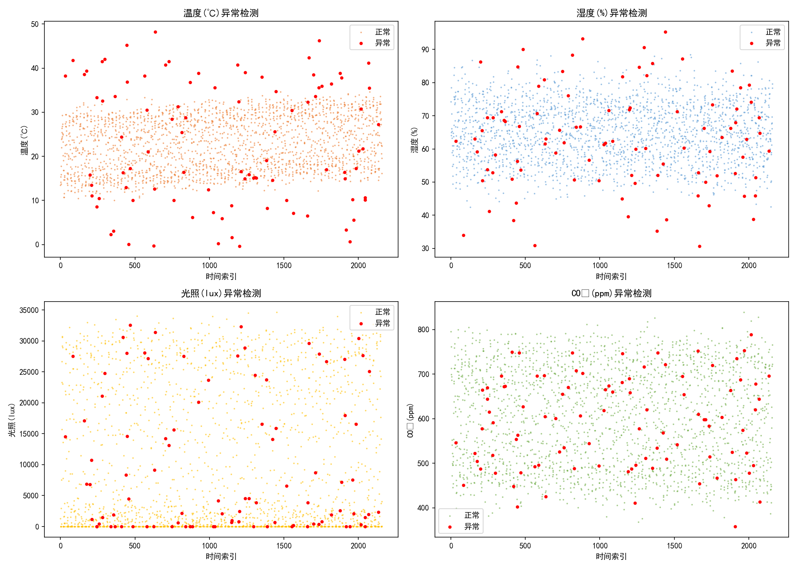
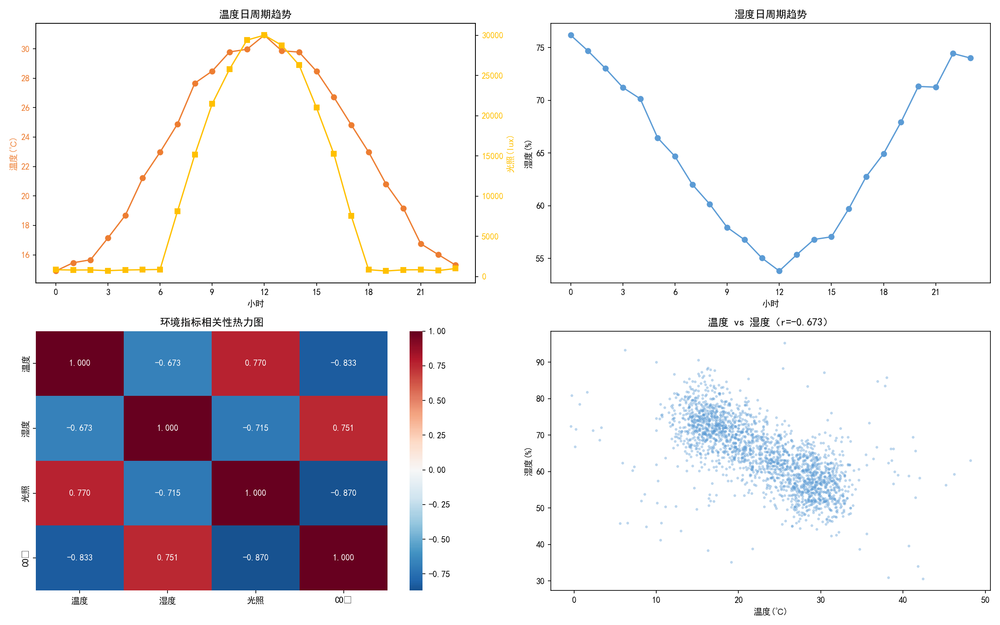

# 智能大棚环境监测数据分析系统

> 数据库课程设计 | 2024.09 - 2024.12

## 项目简介

设计并实现智能大棚环境监测系统，负责环境数据的存储和分析部分。大棚内部署温度、湿度、光照、CO₂四类传感器，每小时采集一次数据。通过对3个月约2000条时序数据进行统计分析、异常检测、趋势分析和相关性分析，定位影响作物生长的核心环境因子，搭建三级异常预警规则，并输出分时段环境调控方案。

## 技术栈

- **编程语言**：Python
- **数据库**：SQLite（greenhouse.db）
- **数据处理**：Pandas、NumPy
- **SQL查询**：分组统计（GROUP BY）、条件筛选（WHERE）、子查询、UPDATE更新
- **异常检测**：阈值法、3σ统计法
- **统计分析**：皮尔逊相关系数、时序趋势分析
- **可视化**：Matplotlib、Seaborn

## 数据库设计

### 传感器数据表（sensor_data）

| 字段 | 类型 | 说明 |
|------|------|------|
| id | INTEGER | 主键，自增 |
| timestamp | DATETIME | 采集时间（精确到秒） |
| date | DATE | 日期（用于按天统计） |
| hour | INT | 小时（用于按时段分析） |
| temperature | FLOAT | 温度(℃) |
| humidity | FLOAT | 湿度(%) |
| light | FLOAT | 光照强度(lux) |
| co2 | FLOAT | CO₂浓度(ppm) |
| is_anomaly | TINYINT | 是否异常（0正常，1异常） |

### 索引设计
- `idx_timestamp`：按时间范围查询加速
- `idx_date`：按天统计加速

## 项目流程

### 1. 数据库设计与数据采集
- 设计传感器时序数据表，建立时间索引优化查询性能
- 模拟4类传感器每小时采集一次，共3个月（90天）数据，合计2160条
- 数据字段：温度、湿度、光照强度、CO₂浓度

### 2. 数据统计（SQL GROUP BY）
- **日均统计**：按date分组，计算每天的温度均值/最高/最低、湿度均值等
- **周均统计**：按周分组，观察环境指标的周变化趋势
- **小时统计**：按hour分组，分析环境指标的日周期规律

### 3. 异常数据检测（两种方法结合）

#### 方法1：阈值法（SQL WHERE条件筛选）
- 根据作物生长适宜范围设定上下限
- 温度：10-35℃，湿度：30-90%，光照：0-60000lux，CO₂：300-1000ppm
- 超出范围即标记为异常

#### 方法2：统计法（3σ原则，SQL子查询计算均值标准差）
- 计算每个指标的均值和标准差
- 超出均值±3倍标准差的标记为异常
- 能检测出不明显但偏离正常范围的异常

#### 检测结果
- 综合两种方法，共检测出约5%的异常数据
- 异常原因：传感器故障、极端天气
- 使用UPDATE语句将异常标记写回数据库

### 4. 趋势分析
- **日周期**：温度和光照呈明显的日周期变化（白天高晚上低），湿度在阴雨天明显升高
- **季节趋势**：9月到12月温度逐渐下降，符合季节变化规律
- **时段规律**：下午2-5点温度最高，凌晨温度最低

### 5. 相关性分析（皮尔逊相关系数）

| 指标对 | 相关系数 | 关系 |
|--------|----------|------|
| 温度 vs 光照 | **0.8** | 强正相关 |
| 温度 vs 湿度 | **-0.6** | 负相关 |
| 温度 vs CO₂ | -0.3 | 弱负相关 |
| 湿度 vs 光照 | -0.5 | 负相关 |

**核心结论：温度是影响作物生长最核心的环境因子**，与其他指标相关性最强，且对作物生长速度影响最大。

### 6. 异常预警规则（三级预警）

| 预警级别 | 触发条件 | 处理措施 |
|----------|----------|----------|
| 黄色预警 | 温度超出适宜范围(15-30℃)但不严重，或单一指标短时异常 | 自动记录，管理员查看 |
| 橙色预警 | 温度低于10℃或高于35℃，或连续3小时指标异常 | 通知管理员，启动设备 |
| 红色预警 | 温度低于5℃或高于40℃，或多个指标同时严重异常 | 自动启动温控设备，短信通知 |

### 7. 分时段调控方案

| 时段 | 调控措施 |
|------|----------|
| 凌晨(0-6点) | 温度低，关闭通风口，开启保温设备；注意除湿 |
| 上午(6-12点) | 温度升高，适当通风；光照过强拉遮阳网 |
| 下午(12-18点) | 温度最高，加强通风降温；中午拉遮阳网；适当喷雾增湿 |
| 傍晚(18-24点) | 温度下降，关闭通风口保温；收起遮阳网 |

## 核心数据

| 指标 | 数值 |
|------|------|
| 数据时长 | 3个月（90天） |
| 数据量 | 2,160条（每小时1条） |
| 监测指标 | 温度、湿度、光照、CO₂ |
| 异常比例 | 约5% |
| 核心因子 | 温度 |
| 预警级别 | 三级（黄/橙/红） |

## 项目成果

### 异常检测

### 趋势与相关性分析

## 个人收获

1. 掌握了时序数据的存储和查询方法，学会了通过建立索引优化时间范围查询性能
2. 熟练使用SQL进行分组统计、条件筛选、子查询、数据更新等操作
3. 掌握了两种异常检测方法：阈值法（基于业务规则）和统计法（基于3σ原则），理解了各自的适用场景
4. 学会了通过相关性分析找到指标之间的关系，定位核心影响因子
5. 体会到了物联网数据分析的价值——通过传感器数据实现精准农业，科学调控环境，提高作物产量

## 文件说明

| 文件 | 说明 |
|------|------|
| `greenhouse_analysis.py` | 完整可运行代码 |
| `greenhouse.db` | SQLite数据库文件（含传感器数据表） |
| `greenhouse_data.csv` | 完整传感器数据（含异常标记） |
| `daily_stats.csv` | 日均统计（SQL查询结果） |
| `weekly_stats.csv` | 周均统计（SQL查询结果） |
| `images/` | 运行生成的可视化图表 |
